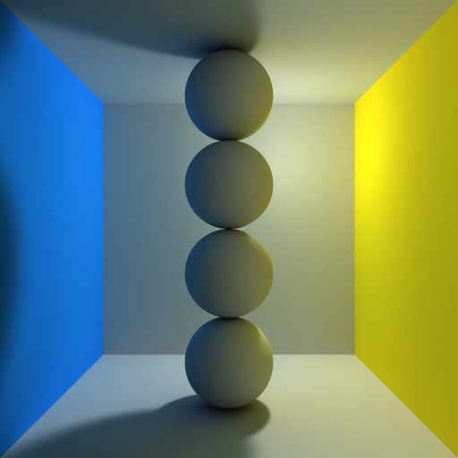
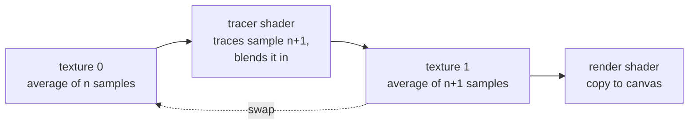
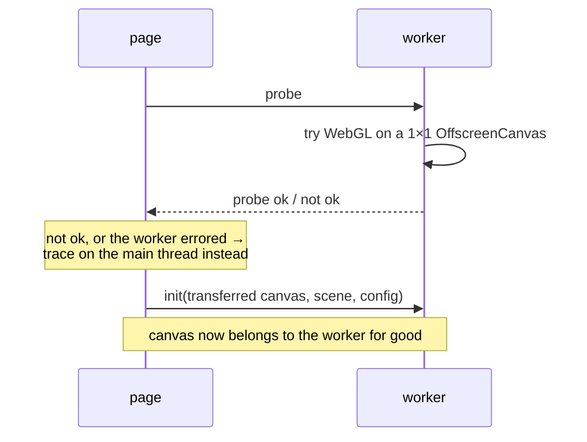

# WebGL Path Tracing



[Try it live](https://webgl-path-tracing.steren.fr)

A path tracer that runs in the browser, in real time, on the GPU. The whole
scene is compiled into a GLSL fragment shader; every pixel of the canvas is one
invocation of that shader following light backwards through the room. The image
starts grainy and sharpens as samples accumulate, and it keeps accumulating for
as long as nothing moves.

Originally written by [Evan Wallace](http://madebyevan.com/webgl-path-tracing/).

This README is about how it works. If you just want to use it, skip to
[Using it as a module](#using-it-as-a-module).

## The idea

The colour of a pixel is the light arriving at the camera through that pixel.
That light came from a lamp, bounced off some number of surfaces, and lost some
of itself to the colour of each one on the way. There is no closed form for
that: the light arriving at a point depends on the light arriving at every
other point that can see it.

So it is estimated by sampling. Shoot a ray from the camera through the pixel,
let it bounce around the room a few times, and at every bounce ask "how much
light reaches *here* directly from the lamp?" — a question that is easy to
answer, because it is just one shadow ray. Add those contributions up, tinted
by every surface the path has touched so far, and you have one estimate of the
pixel's colour. It is a bad estimate: the path made several random choices, and
a different set of choices gives a noticeably different answer.

Average enough of those estimates, though, and the noise cancels out. That is
the whole algorithm. Everything below is about making the average converge
quickly, and about getting as many estimates per second as the hardware will
give.

## The image is an average, not a drawing

Nothing is drawn to the screen directly. The tracer keeps two textures the size
of the canvas and ping-pongs between them:



The tracer shader reads the running average, traces one new sample, and writes
the two blended together into the other texture. The blend weight is what makes
it an average rather than a fade:

```glsl
vec3 accumulated = texture2D(texture, gl_FragCoord.xy / resolution).rgb;
gl_FragColor = vec4(mix(calculateColor(initialOrigin, initialRay), accumulated, textureWeight), 1.0);
```

with `textureWeight = n / (n + 1)`, so sample `n + 1` gets exactly its `1/(n+1)`
share. The two textures are then swapped, and a second trivial shader copies the
newest one to the canvas.

The accumulation textures are floating point (`RGBA32F`, falling back to
`RGBA16F` on GPUs that can render to half float but not float). This matters
more than it sounds: after a thousand samples each new one moves the average by
a thousandth, which in 8-bit fixed point rounds to nothing at all. The image
would stop converging and keep a permanent grain. `chooseTextureFormat()` picks
the best format the context will actually *render* to — support for sampling a
format does not imply support for drawing to it, so each candidate is tested by
attaching it to a framebuffer and asking — and only uses 8-bit as a last resort.

Any change to what the camera sees — orbiting, zooming, dragging an object,
switching projection — resets `sampleCount` to zero, and the average starts
again from the next sample.

## The scene is compiled into a shader

There is no scene buffer and no acceleration structure. Every object in the
scene emits its own GLSL, and `makeTracerFragmentSource()` concatenates the
lot into one fragment shader that is then compiled. Each shape implements five
hooks:

| hook | emits |
| --- | --- |
| `getGlobalCode()` | the shape's `uniform` declarations |
| `getIntersectCode()` | `float tSphere3 = intersectSphere(origin, ray, sphereCenter3, sphereRadius3);` |
| `getMinimumIntersectCode()` | `if(tSphere3 < t) t = tSphere3;` |
| `getNormalCalculationCode()` | `else if(t == tSphere3) { normal = ...; surfaceColor = color3; }` |
| `getShadowTestCode()` | an early `return 0.0;` if this shape blocks the shadow ray |

The shape's `id` is pasted straight into those identifiers, which is why ids
have to be unique within a scene — two objects sharing one would redeclare a
uniform and the shader would fail to compile.

The split between what is baked into the source and what is a uniform decides
what is free and what is expensive:

- **Uniforms** — positions, radii, corners, colours, the light position, the
  glossiness. Changing these costs one `gl_uniform*` call, so objects can be
  dragged around at full speed.
- **Baked into the source** — the number of objects, which shapes they are, the
  material, the environment, the bounce count. Changing any of these means
  regenerating the source and recompiling. `setObjects()` compiles the new
  program *before* touching any state, so a scene that fails to compile leaves
  the working one running instead of leaving the tracer half-updated.

The room itself is not an object. It is a fixed `[-1, 1]` cube baked into the
shader header, and the tracer deliberately takes the *far* intersection with it
(`t = tRoom.y`) so that a camera sitting outside the box sees the inside of the
back wall rather than the outside of the front one. Its normals are flipped
inward for the same reason. The `environment` setting paints the two side walls
by position (`hit.x < -0.9999` and `hit.x > 0.9999`) for the Cornell box looks.

## Tracing one path

`makeCalculateColor()` generates the loop every pixel runs. Stripped of the
generated per-object lines it is:

```glsl
vec3 calculateColor(vec3 origin, vec3 ray) {
  vec3 colorMask = vec3(1.0);        // what this path has been tinted by so far
  vec3 accumulatedColor = vec3(0.0); // what it has collected so far

  for(int bounce = 0; bounce < 5; bounce++) {
    // this bounce's random numbers, and a jittered point on the light
    vec3 lightRandom  = sampleCube(lightSamples[bounce],  float(bounce) * 2.0);
    vec3 bounceRandom = sampleCube(bounceSamples[bounce], float(bounce) * 2.0 + 1.0);
    vec3 lightPos = light + uniformlyRandomVector(lightRandom) * lightSize;

    // 1. closest hit
    //    (every object's intersection is computed, then minimised over)
    // 2. normal and surface colour at that hit
    // 3. direct light, through a shadow ray
    vec3 toLight = lightPos - hit;
    float diffuse = max(0.0, dot(normalize(toLight), normal));
    float shadowIntensity = 0.0;
    if(diffuse > 0.0 || specularHighlight > 0.0) {
      shadowIntensity = shadow(hit + normal * epsilon, toLight);
    }

    // 4. accumulate, tinted by everything the path has touched
    colorMask *= surfaceColor;
    accumulatedColor += colorMask * (lightVal * diffuse * shadowIntensity);
    accumulatedColor += colorMask * specularHighlight * shadowIntensity;

    // 5. scatter into the next ray
    ray = /* depends on the material */;
    origin = hit;
  }

  return accumulatedColor;
}
```

Three things are worth pulling out of that.

**`colorMask` is the path's memory.** It is multiplied by each surface colour as
the path goes, so light picked up at the fourth bounce arrives tinted by all
four surfaces it travelled through. That single line is what produces colour
bleeding — the red wall of a Cornell box staining the white floor beside it —
without anything in the code being about colour bleeding.

**Light is gathered at every bounce, not just at the end.** Each bounce asks the
lamp directly (this is next-event estimation), instead of hoping a randomly
scattered ray eventually stumbles into it. A path that never finds the light
still contributes at every step.

**The shadow ray is skipped when it cannot matter.** If the surface faces away
from the light and there is no highlight, both terms are multiplied by zero, so
tracing the shadow ray would be a full scene traversal thrown away. On a diffuse
surface that is roughly half of all shading points.

Two simplifications are deliberate: the direct term is `lightVal * N·L` with no
inverse-square falloff, and the lamp itself is invisible — `Light` emits no
intersection code at all, so it lights the room without appearing in it. It is
still selectable and draggable in the UI.

### Finding the closest hit

Every object's intersection is computed unconditionally, then the nearest is
picked with a chain of comparisons. With no branching and no traversal, the cost
of a frame is linear in the number of objects — fine for the few dozen a scene
here holds, and the reason there is no thousand-object demo.

- **Sphere** — the quadratic `|origin + t·ray - center|² = r²`, taking the near
  root if it is positive.
- **Cube** — the slab method: intersect the three pairs of parallel planes, keep
  the largest near and the smallest far, and a miss is simply `tNear > tFar`.
  The normal comes from normalising the hit into the cube's own `[-1, 1]` space
  and taking the axis with the largest coordinate, which is branch-free and
  works for very thin boxes where an absolute epsilon would misclassify the
  face.
- **Extruded rectangle** — a box whose cross-section has rounded corners, like a
  CSS `border-radius` extruded into a solid. It is convex, so a ray crosses it
  over one interval, and it is covered by six convex pieces: two boxes crossing
  in a plus shape plus four corner cylinders, each clipped to the flat ends. The
  interval is the union of the pieces' intervals, and `unionInterval()` ignores
  pieces the ray missed because they arrive with `near > far`. Its normal is the
  direction away from the inner box the shape is the sweep of, or the extrusion
  axis when the hit is on a flat end, whichever is closer relative to its own
  extent.

Shadow rays use the same intersection code with a different question — not "how
far?" but "is there anything in the way?" — so `shadow()` returns `0.0` at the
first hit with `epsilon < t < 1.0`. The ray is deliberately not normalised, so
`t = 1` is exactly the light and anything beyond it does not count. The
`epsilon` lower bound, along with offsetting the ray origin by
`normal * epsilon`, keeps a surface from shadowing itself and speckling its own
lit side.

### Scattering

The material is a global setting (all objects share it; the room is always
diffuse) and picks both the highlight added at the hit and the direction the
path continues in:

| material | outgoing ray | highlight |
| --- | --- | --- |
| diffuse | `cosineWeightedDirection(...)` | none |
| mirror | `reflect(ray, normal)` | `2·(R·V)²⁰` |
| glossy | `normalize(reflect(ray, normal)) + uniformlyRandomVector(...) * glossiness` | `(R·V)³` |

The diffuse direction is cosine-weighted rather than uniform over the
hemisphere, which is exactly the distribution the `N·L` term wants, so the
weight cancels out and no division is needed. Building the tangent basis for it
normalises the cross product — `cross(normal, axis)` is only unit length when
the two are perpendicular, and skipping that skews the distribution on every
tilted surface.

The last bounce shades its hit point but never generates an outgoing ray,
because nothing would trace it.

### Soft shadows

The lamp is a region, not a point: `light + uniformlyRandomVector(...) *
lightSize`. Each sample picks a different point on it, so a shading point on the
edge of a shadow is lit some of the time and not others, and the average is a
penumbra. The jitter is drawn per *bounce* rather than once per path, so
successive bounces of one path do not share the same error.

## Choosing the random numbers

Every random choice a path makes is one coordinate of a point in a
high-dimensional unit cube: two dimensions to position the sample within the
pixel, then three for the point on the light and three for the scattered
direction, at each of the five bounces — 32 dimensions in all.

Drawing those points independently at random is what makes a path tracer
grainy. Independent points clump together and leave gaps, and the error falls
only as `1/√samples`. So the tracer walks a **scrambled Halton sequence**
instead: coordinate *d* of point *n* is *n* written in base *pₔ* (the *d*'th
prime) with its digits reflected about the decimal point, which fills `[0, 1)`
evenly for *any* number of points rather than only in the limit. Written
straight out, high dimensions march in lockstep for long stretches — base 127
counts 1/127, 2/127, … and so does base 131 — so the digits are pushed through a
fixed random permutation per dimension first, which is what keeps the dimensions
independent. In practice this reaches a given amount of grain in roughly two to
three times fewer samples.

The sequence is generated on the CPU in double precision (`makeSampleSequence()`),
which lets the index run into the millions before the sequence loses resolution;
a float32 shader could not. Each sample uploads its 32 coordinates as two small
uniform arrays, `lightSamples` and `bounceSamples`.

That leaves one problem: every pixel would use the same numbers, and a shared
sequence turns leftover error into visible streaks and structured patterns
rather than noise. So each pixel shifts the whole sequence by a constant offset
of its own, wrapping around the unit cube — a Cranley-Patterson rotation:

```glsl
vec3 sampleCube(vec3 sequencePoint, float dimension) {
  return fract(sequencePoint + hash33(vec3(gl_FragCoord.xy, dimension)));
}
```

Shifting an evenly spread set of points leaves it evenly spread, so every pixel
still walks a well-distributed sequence, but no two walk the same one. The hash
is plain multiply-and-fract arithmetic (after Dave Hoskins) rather than the
classic `fract(sin(dot(...)) * 43758.5453)`: `sin()` is only specified to a few
digits in GLSL ES, so that one streaked differently on different drivers and
collapsed into bands for large seeds.

The first two dimensions antialias the image. They offset the sample within its
pixel by up to half a pixel on each axis — a one-pixel box filter — and the
offset is applied to the four corners of the view rather than to the camera
matrix, so the matrix only has to be inverted once per frame. Because those
offsets come out of the same low-discrepancy sequence as everything else, edges
settle down much faster than they would under random jitter.

## The camera

The tracer draws a single full-screen quad, and the vertex shader interpolates
*both ends* of the primary ray across it: four ray origins and four ray
directions, one per corner, bilinearly blended into `initialOrigin` and
`initialRay` for each pixel. Interpolating the origin too is what lets one
shader serve both projections:

- **Perspective** — every ray starts at the eye and the direction varies, so
  objects shrink with distance and the walls converge.
- **Orthographic** — the direction is fixed (straight back down the eye vector)
  and the *origin* varies, so parallel edges stay parallel and an object is the
  same size wherever it sits. This is the projection technical and isometric
  renders use.

Each corner is found by unprojecting `(x, y, 0, 1)` through the inverted
modelview-projection and dividing by *w*. That runs four times per sample rather
than once per frame, so it is done with a hand-rolled matrix multiply
(`cameraCornerInto()`) instead of the generic vector library, which would
allocate half a dozen objects per call.

An orthographic camera's rays do not spread out with distance, so any part of
the view wider than the room is filled with rays that pass the room by and hit
nothing. By default the view is therefore sized to frame the room, with a small
margin that keeps the corners — and the sub-pixel jitter around them — off the
edges where a ray would run *along* a wall instead of into it. `orthoHeight`
overrides that, which is what zooming means when there is no vanishing point.

The camera always orbits the origin; dragging on empty canvas updates two
angles, clamped just short of the poles so the view never goes upside down.

## Filling the frame

Accumulating exactly one sample per animation frame caps the tracer at the
refresh rate no matter how fast the GPU is: a modest scene costs a fraction of a
frame, and the rest of every frame is spent waiting for vsync. So the renderer
accumulates as many samples per frame as fit in a frame's worth of time, and
measures its way there.

Measuring is the hard part. WebGL calls only *queue* work — left alone, the
browser keeps firing `requestAnimationFrame` at the refresh rate while the
driver falls further and further behind, and every frame looks like a
comfortable 60fps regardless of how much work is outstanding. That is exactly
the wrong signal to size a budget from. So each frame ends by reading one pixel
back:

```js
gl.readPixels(0, 0, 1, 1, gl.RGBA, gl.UNSIGNED_BYTE, syncPixel);
```

which cannot return until the GPU has caught up. (`gl.finish()` is meant to do
this and is a bare flush on several drivers.)

`updateFrameBudget()` then adjusts a running estimate of what one sample costs:

- **Over the 13ms budget** — that measurement finally puts a real number on the
  cost of a sample, so take it at once rather than averaging it in, and a scene
  that just got heavier does not spend several slow frames walking back down.
  The estimate is not allowed to more than halve in one step, so a hitch
  elsewhere on the page cannot collapse the budget either.
- **Under budget** — this only says a sample costs *at most* that much, never how
  much of the frame was left over. So assume a little more room each time
  (`msPerSample *= 0.92`) and let the branch above catch the overshoot.

The count lands at `floor(13ms / msPerSample)`, capped at 64. On hardware that a
single sample already saturates it settles back at one per frame and behaves as
it always did. `samplesPerFrame` in the config pins it instead, which is what a
benchmark or a deliberately light background animation wants.

## Rendering in a worker

The tracing runs in a web worker, against an `OffscreenCanvas` that the page
hands over when the tracer starts. The page keeps the canvas element and its
event listeners and nothing else.

This follows directly from the paragraph above. Sizing the sample budget means
waiting for the GPU to catch up, and that wait blocks whichever thread does it.
On the main thread it blocks the *page*: with the budget aiming to fill most of
a frame with tracing, scrolling, layout and everything else have to wait for the
tracer between every frame, and a scene heavy enough to run at a few frames a
second takes the page down with it. In a worker it blocks nobody. Compiling the
scene into a shader, which happens on every geometry or material change, moves
off the main thread with it.

Handing the canvas over cannot be undone, so the worker is asked whether it can
render *before* the transfer — some browsers have `OffscreenCanvas` but no WebGL
inside a worker:



Until that settles, calls from the page queue up and are replayed against
whichever side ends up owning the scene, so there is nothing to wait for.
`makePathTracer()` therefore returns a controller rather than the renderer
itself — the renderer is usually on the other side of a message port — and every
method turns into a message. `applyMessage()` on the far side is the single
dispatch both paths go through, so the worker and the main-thread fallback
cannot drift apart. Scenes travel as plain arrays and numbers, since structured
clone drops the prototypes that generate the shader, and get rebuilt on arrival.

Pass `worker: false` to always trace on the main thread.

## Interaction

Picking cannot be done in the shader, so each shape also implements its
intersection test in JavaScript, mirroring the GLSL — including the extruded
rectangle's union of convex pieces. A press unprojects the pointer into a
camera ray, tests the selected object's bounding box first (so a face of it can
be grabbed and dragged) and then every object, nearest hit wins. Missing
everything means the gesture is a camera orbit instead.

Dragging moves the object along the plane of the box face that was grabbed via
`temporaryTranslate()`, which only changes uniforms — no recompile — and resets
the sample count on every move. Releasing commits the translation.

The page half tracks only whether a gesture is in progress; *what* the gesture
turned out to be is decided where the scene lives, which may be another thread.

## Where things live

| file | |
| --- | --- |
| `path-tracer-core.js` | everything above: shader generation, shapes, sampling, camera, render loop. DOM-free, so it runs unchanged on either thread |
| `path-tracer-worker.js` | the worker shell — owns the WebGL context and turns messages into core calls |
| `webgl-path-tracing.js` | the page-facing entry point: canvas, event listeners, worker setup and fallback |
| `glUtils.js` | `makeLookAt`, `makePerspective`, `makeOrtho` |
| `sylvester.src.js` | vector and matrix maths |
| `scenes.js` | the demo scenes |
| `index.html` | the demo page |

## Using it as a module

Install with `npm install webgl-path-tracing`, then use your favourite bundler,
or add it to a page directly:

```html
<script type="importmap">
	{
		"imports": {
			"webgl-path-tracing": "./node_modules/webgl-path-tracing/webgl-path-tracing.js",
			"sylvester": "./node_modules/webgl-path-tracing/sylvester.src.js"
		}
	}
</script>

<script type="module">
	import {makePathTracer, Cube, Sphere, ExtrudedRectangle} from 'webgl-path-tracing';
	import {Vector} from 'sylvester';

	let objects = [];
	let nextObjectId = 0;
	objects.push(new Cube(Vector.create([-0.25, -1, -0.25]), Vector.create([0.25, -0.75, 0.25]), nextObjectId++));
	objects.push(new Sphere(Vector.create([0, -0.75, 0]), 0.25, nextObjectId++));
	objects.push(new ExtrudedRectangle(Vector.create([-0.5, -0.5, -0.1]), Vector.create([0.5, 0, 0.1]), 0.15, nextObjectId++));

	window.onload = function() {
		makePathTracer(document.getElementById('canvas'), objects);
	}
</script>
<canvas id="canvas" width="512" height="512"></canvas>
```

The canvas can be any size, square or not.

### Shapes

- `new Sphere(center, radius, id, color)`
- `new Cube(minCorner, maxCorner, id, color)`
- `new ExtrudedRectangle(minCorner, maxCorner, borderRadius, id, color, axis)`

An extruded rectangle rounds off the four edges running along `axis` (`'x'`,
`'y'` or `'z'`, default `'z'`) by `borderRadius` and leaves the two ends flat.
The radius is clamped to half of the smaller side of the cross-section; a radius
of 0 gives a plain box.

`color` is optional and defaults to a neutral grey. `id` has to be unique within
a scene, since it names the shape's uniforms in the generated shader.

### Config

`makePathTracer(canvas, objects, config, interactive, log)`

| option | |
| --- | --- |
| `material` | `0` diffuse, `1` mirror, `2` glossy |
| `glossiness` | 0–1, glossy only |
| `environment` | `'cornell-yellow-blue'`, `'cornell-red-green'`, or unset for plain walls |
| `bounces` | light bounces per ray (default 5) |
| `zoom` | camera distance from the centre |
| `projection` | `'perspective'` (default) or `'orthographic'` |
| `fov` | field of view in degrees, perspective only |
| `orthoHeight` | height of the orthographic view in world units; defaults to framing the room |
| `lightPosition` | `[x, y, z]` |
| `lightSize` | radius of the light region — larger means softer shadows |
| `lightVal` | 0–1 |
| `samplesPerFrame` | pins the per-frame sample count; adaptive by default |
| `worker` | `false` to trace on the main thread |

### Controls

`makePathTracer()` returns an object with `setObjects`, `addSphere`, `addCube`,
`addExtrudedRectangle`, `selectLight`, `deleteSelection`, `setLightPosition`,
`setLightVal`, `updateMaterial`, `updateEnvironment`, `updateProjection`,
`updateOrthoHeight`, `updateGlossiness`, `renderer.pause()`, `renderer.resume()`
and `dispose()`. Calls made before the worker has started are queued and
replayed, so there is nothing to wait for.

```js
const ui = makePathTracer(canvas, objects);
ui.updateProjection('orthographic');
ui.updateOrthoHeight(1.5); // null goes back to the default framing
```

## Limitations

Worth knowing before extending it:

- **One light**, a sphere of `lightSize`, always inside the room, invisible to
  camera rays, with no distance falloff.
- **No acceleration structure.** Every ray tests every object, and the object
  list is baked into the shader, so scenes stay in the tens of objects.
- **One material for the whole scene** (per-object *colour*, but not per-object
  material), and the room is always diffuse.
- **No refraction, no textures, no triangle meshes** — three analytic shapes,
  plus the room.
- **Five bounces by default**, with no Russian roulette: paths are simply cut
  off, which loses a little energy in a very bright, very bouncy scene.

## License

MIT. See the header of `webgl-path-tracing.js`.
